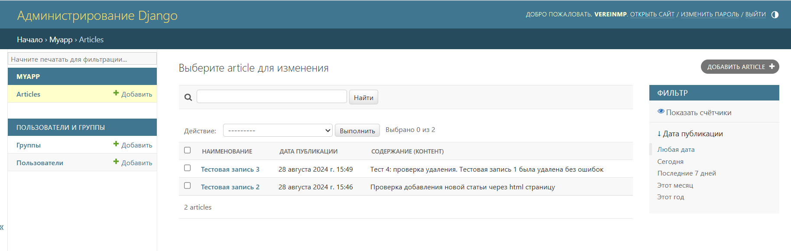
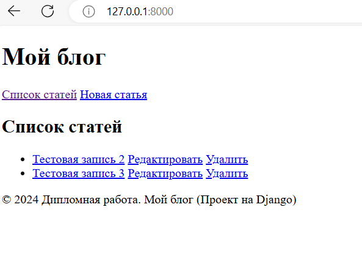
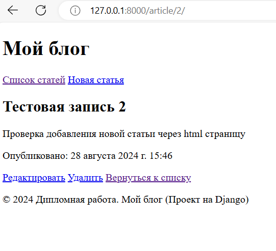
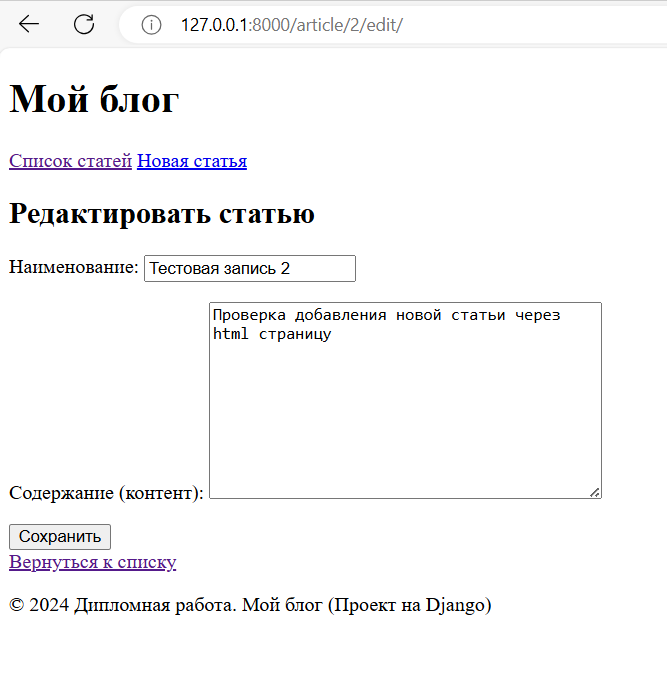
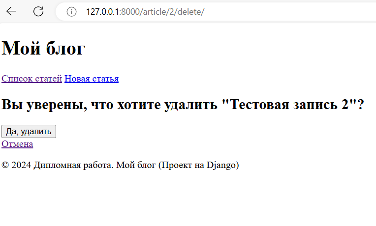
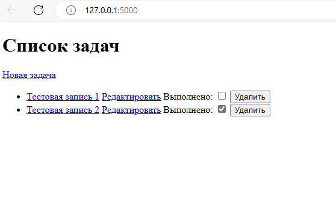
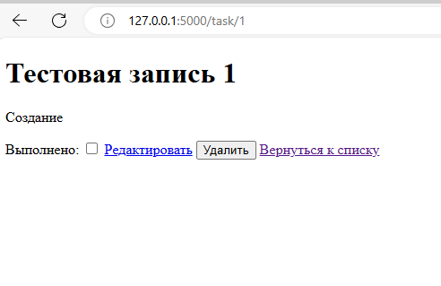
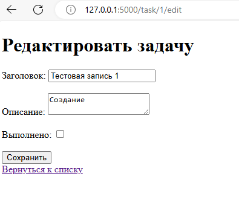

# Дипломная работа 
___
## TEMA: Разработать простые веб-приложения с использованием Django, Flask и FastAPI, провести их сравнение.
### Автор: Вереин Михаил Павлович
___
__Оглавление дипломной работы:__
1. Введение
2. Цель и задачи
3. Методология
4. Разработка приложений
5. Сравнение фреймворков
6. Заключение
7. Список литературы
___
## 1. Введение

В современном мире веб-разработки существует множество фреймворков, каждый из которых имеет свои особенности и
преимущества. В данной дипломной работе будет проведено сравнение трех популярных Python-фреймворков: Django, Flask и
FastAPI. Целью работы является анализ и сравнение этих фреймворков с точки зрения их использования для разработки простых
веб-приложений.

## 2. Цель и задачи

  Цель работы: Провести анализ и сравнение трех Python-фреймворков (Django, Flask, FastAPI) для разработки простых веб-приложений.
Задачи:
Изучить особенности и преимущества каждого из фреймворков.
Разработать простые веб-приложения с использованием Django, Flask и FastAPI.
Провести сравнение фреймворков по различным критериям: производительность, простота использования, гибкость, документация и сообщество.
Сделать выводы о наиболее подходящем фреймворке для различных типов проектов.

## 3. Методология

Исследование литературы и ресурсов: Изучение документации, статей, блогов и других источников информации о Django, Flask и FastAPI.
Разработка приложений: Создание простых веб-приложений с использованием каждого из фреймворков.
Тестирование и сравнение: Проведение тестов для оценки производительности, простоты использования и других критериев.
Анализ результатов: Сравнение результатов и формулирование выводов.

## 4. Разработка приложений

* [Django](https://github.com/mixupp83/graduateWork/tree/master/graduate_django/graduate_project)

### *Описание проекта:* 

Создание простого блога с функционалом добавления, редактирования и удаления статей.

Проект представляет собой простой блог, разработанный с использованием фреймворка Django. Основные функции включают 
создание, редактирование, просмотр и удаление статей. Приложение также включает административный интерфейс для 
управления контентом.

### *Структура проекта:*

Проект состоит из следующих основных компонентов:
* Модели (models.py): Определение модели Article, которая содержит поля title, content и pub_date.
* Формы (forms.py): Определение формы ArticleForm для создания и редактирования статей.
* Представления (views.py): Обработка запросов и управление логикой приложения.
* Шаблоны (templates/myapp): HTML-шаблоны для отображения списка статей, деталей статьи, формы редактирования и подтверждения удаления.
* Административная панель (admin.py): Настройка административного интерфейса для управления статьями.

### *Детали реализации*

*Модели (models.py)*
```python
class Article(models.Model):
    title = models.CharField(max_length=200, verbose_name='Наименование')
    content = models.TextField(verbose_name='Содержание (контент)')
    pub_date = models.DateTimeField(default=timezone.now, verbose_name='Дата публикации')

    def __str__(self):
        return self.title
```
Модель Article содержит следующие поля:
* title: Заголовок статьи (CharField).
* content: Содержание статьи (TextField).
* pub_date: Дата публикации статьи (DateTimeField).

*Формы (forms.py)*
```python
class ArticleForm(forms.ModelForm):
    class Meta:
        model = Article
        fields = ['title', 'content']
```
Форма ArticleForm используется для создания и редактирования статей. Она наследуется от forms.ModelForm и определяет 
модель Article и поля title и content.

*Представления (views.py)*
```python
def article_list(request):
    articles = Article.objects.all()
    return render(request, 'myapp/article_list.html', {'articles': articles})

def article_detail(request, pk):
    article = get_object_or_404(Article, pk=pk)
    return render(request, 'myapp/article_detail.html', {'article': article})

def article_new(request):
    if request.method == "POST":
        form = ArticleForm(request.POST)
        if form.is_valid():
            article = form.save(commit=False)
            article.save()
            return redirect('article_detail', pk=article.pk)
    else:
        form = ArticleForm()
    return render(request, 'myapp/article_edit.html', {'form': form})

def article_edit(request, pk):
    article = get_object_or_404(Article, pk=pk)
    if request.method == "POST":
        form = ArticleForm(request.POST, instance=article)
        if form.is_valid():
            article = form.save(commit=False)
            article.save()
            return redirect('article_detail', pk=article.pk)
    else:
        form = ArticleForm(instance=article)
    return render(request, 'myapp/article_edit.html', {'form': form})

def article_delete(request, pk):
    article = get_object_or_404(Article, pk=pk)
    if request.method == "POST":
        article.delete()
        return redirect('article_list')
    return render(request, 'myapp/article_confirm_delete.html', {'article': article})
```
* article_list: Отображает список всех статей.
* article_detail: Отображает детали конкретной статьи.
* article_new: Создает новую статью.
* article_edit: Редактирует существующую статью.
* article_delete: Удаляет статью после подтверждения.

*Шаблоны (templates/myapp)*
* article_list.html: Отображает список всех статей.
```html
    <h2>Список статей</h2>
    <ul>
        
            <li>
                <a href="">{{ article.title }}</a>
                <a href="">Редактировать</a>
                <a href="">Удалить</a>
            </li>
        
    </ul>
```
* article_detail.html: Отображает детали конкретной статьи.
```html

    <h2>{{ article.title }}</h2>
    <p>{{ article.content }}</p>
    <p>Опубликовано: {{ article.pub_date }}</p>
    <a href="">Редактировать</a>
    <a href="">Удалить</a>
    <a href="">Вернуться к списку</a>

```
* article_edit.html: Форма для создания и редактирования статей.
```html

    <h2>Редактировать статью</h2>
    <form method="POST">
        
        {{ form.as_p }}
        <button type="submit">Сохранить</button>
    </form>
    <a href="">Вернуться к списку</a>

```
* article_confirm_delete.html: Форма подтверждения удаления статьи.
```html

    <h2>Вы уверены, что хотите удалить "{{ article.title }}"?</h2>
    <form method="POST">
        
        <button type="submit">Да, удалить</button>
    </form>
    <a href="">Отмена</a>

```
* Административная панель (admin.py)
```python
class ArticleAdmin(admin.ModelAdmin):
    list_display = ('title', 'pub_date', 'content')
    list_filter = ('pub_date',)
    search_fields = ('title', 'content')

admin.site.register(Article, ArticleAdmin)
```
Настроена административная панель для управления статьями. Определен класс ArticleAdmin, который настраивает отображение
списка статей, фильтрацию по дате публикации и поиск по заголовку и содержанию.



### *Примеры работы*
Список статей



Детали статьи



Форма редактирования статьи



Форма подтверждения удаления статьи



* [Flask](https://github.com/mixupp83/graduateWork/tree/master/graduate_flask)

### *Обзор проекта*

Проект представляет собой простое веб-приложение для управления списком задач (To-Do List), разработанное с использованием
фреймворка Flask и базы данных SQLite. Основные функции включают создание, редактирование, просмотр, завершение и удаление
задач.

### *Структура проекта*
Проект состоит из следующих основных компонентов:
* app.py: Основной файл приложения, содержащий настройки, модели и представления.
* templates/: Папка с HTML-шаблонами для отображения списка задач, деталей задачи, формы редактирования и подтверждения удаления.

### *Детали реализации*

*Модели:* 
```python
class Task(db.Model):
    id = db.Column(db.Integer, primary_key=True)
    title = db.Column(db.String(200), nullable=False)
    description = db.Column(db.Text, nullable=False)
    completed = db.Column(db.Boolean, default=False)

    def __repr__(self):
        return f'<Task {self.title}>'
```
Модель Task содержит следующие поля:
* id: Уникальный идентификатор задачи (Integer, primary_key).
* title: Заголовок задачи (String).
* description: Описание задачи (Text).
* completed: Флаг завершения задачи (Boolean, default=False).

*Представления*

Все представления находятся в файле app.py:
* task_list: Отображает список всех задач.
```python
@app.route('/')
def task_list():
    tasks = Task.query.all()
    return render_template('task_list.html', tasks=tasks)
```
* task_detail: Отображает детали конкретной задачи.
```python
@app.route('/task/<int:task_id>')
def task_detail(task_id):
    task = Task.query.get_or_404(task_id)
    return render_template('task_detail.html', task=task)
```
* task_new: Создает новую задачу.
```python
@app.route('/task/new', methods=['GET', 'POST'])
def task_new():
    if request.method == 'POST':
        title = request.form['title']
        description = request.form['description']
        completed = 'completed' in request.form
        new_task = Task(title=title, description=description, completed=completed)
        db.session.add(new_task)
        db.session.commit()
        return redirect(url_for('task_detail', task_id=new_task.id))
    return render_template('task_edit.html')
```
* task_edit: Редактирует существующую задачу.
```python
@app.route('/task/<int:task_id>/edit', methods=['GET', 'POST'])
def task_edit(task_id):
    task = Task.query.get_or_404(task_id)
    if request.method == 'POST':
        task.title = request.form['title']
        task.description = request.form['description']
        task.completed = 'completed' in request.form
        db.session.commit()
        return redirect(url_for('task_detail', task_id=task.id))
    return render_template('task_edit.html', task=task)
```
* task_complete: Переключает статус завершения задачи.
```python
@app.route('/task/<int:task_id>/complete', methods=['POST'])
def task_complete(task_id):
    task = Task.query.get_or_404(task_id)
    task.completed = not task.completed
    db.session.commit()
    return redirect(url_for('task_detail', task_id=task.id))
```
* task_delete: Удаляет задачу после подтверждения.
```python
@app.route('/task/<int:task_id>/delete', methods=['POST'])
def task_delete(task_id):
    task = Task.query.get_or_404(task_id)
    db.session.delete(task)
    db.session.commit()
    return redirect(url_for('task_list'))
```

*Шаблоны*

task_list.html: Отображает список всех задач.
```html
    <h1>Список задач</h1>
    <a href="{{ url_for('task_new') }}">Новая задача</a>
    <ul>
        
            <li>
                <a href="{{ url_for('task_detail', task_id=task.id) }}">{{ task.title }}</a>
                <a href="{{ url_for('task_edit', task_id=task.id) }}">Редактировать</a>
                <form action="{{ url_for('task_complete', task_id=task.id) }}" method="POST" style="display:inline;">
                    <label for="completed_{{ task.id }}">Выполнено:</label>
                    <input type="checkbox" id="completed_{{ task.id }}" name="completed" onchange="this.form.submit()" {{ 'checked' if task.completed else '' }}>
                </form>
                <form action="{{ url_for('task_delete', task_id=task.id) }}" method="POST" style="display:inline;">
                    <button type="submit">Удалить</button>
                </form>
            </li>
        
    </ul>

```
task_detail.html: Отображает детали конкретной задачи.
```html
    <h1>{{ task.title }}</h1>
    <p>{{ task.description }}</p>
    <form action="{{ url_for('task_complete', task_id=task.id) }}" method="POST" style="display:inline;">
        <label for="completed">Выполнено:</label>
        <input type="checkbox" id="completed" name="completed" onchange="this.form.submit()" {{ 'checked' if task.completed else '' }}>
    </form>
    <a href="{{ url_for('task_edit', task_id=task.id) }}">Редактировать</a>
    <form action="{{ url_for('task_delete', task_id=task.id) }}" method="POST" style="display:inline;">
        <button type="submit">Удалить</button>
    </form>
    <a href="{{ url_for('task_list') }}">Вернуться к списку</a>
```
task_edit.html: Форма для создания и редактирования задач.
```html
    <h1>Редактировать задачу</h1>
    <form method="POST">
        <label for="title">Заголовок:</label>
        <input type="text" id="title" name="title" value="{{ task.title if task else '' }}" required><br><br>
        <label for="description">Описание:</label>
        <textarea id="description" name="description" required>{{ task.description if task else '' }}</textarea><br><br>
        <label for="completed">Выполнено:</label>
        <input type="checkbox" id="completed" name="completed" {{ 'checked' if task and task.completed else '' }}><br><br>
        <button type="submit">Сохранить</button>
    </form>
    <a href="{{ url_for('task_list') }}">Вернуться к списку</a>
```

*База данных*

База данных SQLite используется для хранения задач. При запуске приложения создается файл tasks.db, если он не существует.

### *Примеры работы*

Список задач: Отображает список всех задач.



Детали задачи: Отображает детали конкретной задачи.



Форма редактирования задачи: Форма для создания и редактирования задач.




* [FastAPI](https://github.com/mixupp83/graduateWork/tree/master/graduate_fastapi)
  * Описание проекта: 
    * Создание простого API для управления книгами в библиотеке.
  * Технические детали:
    * Использование FastAPI для создания маршрутов и обработки запросов.
    * Работа с базой данных через SQLAlchemy.
    * Использование Pydantic для валидации данных.

__5. Сравнение фреймворков__

* Производительность:
  * Django: Хорошая производительность, но может быть избыточен для небольших проектов.
  * Flask: Легковесный и быстрый, подходит для небольших и средних проектов.
  * FastAPI: Высокая производительность, особенно хорош для API и асинхронных задач.
* Простота использования:
  * Django: Богатый функционал, но требует более глубокого изучения.
  * Flask: Простой и гибкий, легко начать использовать.
  * FastAPI: Простой синтаксис, автоматическая генерация документации.
* Гибкость:
  * Django: Большая структура, менее гибкий для нестандартных решений.
  * Flask: Высокая гибкость, позволяет строить приложение по своему усмотрению.
  * FastAPI: Гибкий, но требует более глубокого понимания асинхронного программирования.
* Документация и сообщество:
  * Django: Широкая документация и большое сообщество.
  * Flask: Хорошая документация и активное сообщество.
  * FastAPI: Хорошая документация, но сообщество меньше по сравнению с Django и Flask.

Выводы:
Django подходит для крупных проектов с большим количеством функционала и требований к безопасности.
Flask идеально подходит для небольших и средних проектов, где требуется гибкость и простота.
FastAPI отлично подходит для разработки API с высокой производительностью и асинхронными задачами.

__6. Заключение__

В данной дипломной работе было проведено сравнение трех популярных Python-фреймворков: Django, Flask и FastAPI. Каждый из них имеет свои преимущества и подходит для различных типов проектов.
Выбор фреймворка зависит от конкретных требований проекта, его масштаба и специфики. Например мы можем использовать FastAPI из-за его высокой производительности при разработке API, Flask можно использовать для создания малых и средних проектов с большой гибкостью, а Django — для создания многофункциональных крупномасштабных приложений.

__7. Список литературы__

* [Django Documentation.](https://docs.djangoproject.com/)
* [Flask Documentation.](https://flask.palletsprojects.com/)
* [FastAPI Documentation.](https://fastapi.tiangolo.com/)
* "Django vs Flask vs FastAPI: A Comprehensive Comparison" - Blog post by Towards Data Science.
* "Choosing the Right Python Web Framework" - Article by Real Python.

__Приложение:__

Исходный код разработанных приложений на [Django](https://github.com/mixupp83/graduateWork/tree/master/graduate_django/graduate_project),
[Flask](https://github.com/mixupp83/graduateWork/tree/master/graduate_flask) и 
[FastAPI](https://github.com/mixupp83/graduateWork/tree/master/graduate_fastapi)
